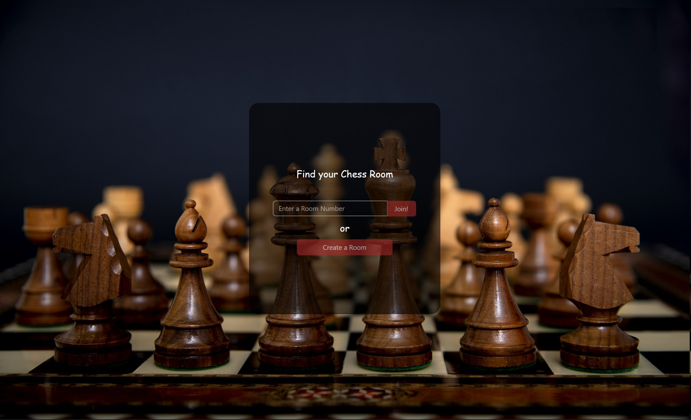

# 網服 期末專題報告

## 服務基本資訊
+ 組別：12 
+ 組長中文姓名：張力升
+ 題目名稱：西洋棋連線對戰遊戲 （原本為棒球紀錄系統，後來改變題目）
+ Deployed service 網址：
+ Github Repo 網址： https://github.com/LiSeng0903/WP_Chess.git
+ Demo 影片網址：
+ FB 社團貼文網址：
描述這個服務在做什麼

## localhost 安裝與測試之詳細步驟
此 Application 為 server-client 架構。執行 server process 的電腦必須要完成後端的所有設置；執行 client 的則須完成前端的所有設置。目前只支援在同一個 subnet 下的電腦連線。

### 安裝
#### 後端設置
1. 下載前端所需 package：在 `final/WP_CHESS/backend` 下執行 `yarn install`
2. 設定 server 執行的 IP，要查看電腦在 LAN 中的 ip 位址，並且修改 `final/WP_CHESS/backend/src/server.js` 中的 `SERVER_IP`，例如 `SERVER_IP = '192.168.1.104'`。
3. 設定 mongoDB：在 `final/WP_CHESS/backend` 下放入 `.env` 檔案。檔案內容加入 `MONGO_URL=<Your mongo url>`
4. 設定 server 使用的 PORT：Server process 設定是使用 port 4000，如果您的電腦 port 4000 已經有跑其他 process 的話，可以在 `.env` 檔案中設定希望 server 執行的 port，加入 `PORT=<desired port>`
5. 初始化資料庫（optinal）：第一次執行可以先初始化 mongodb // not finish
6. 啟動 server：在 `final/WP_CHESS` 下執行 `yarn backend`。待 terminal 出現 `server is on 4000`, `db connected`, `mongo db connection created` 訊息後代表 server 成功執行

#### 前端設置
1. 下載前端所需 package：在 `final/WP_CHESS/frontend` 下執行 `yarn install`
2. 設定 server 執行的 IP，問到執行 server process 電腦的 IP，並且修改 `final/WP_CHESS/frontend/src/containers/hooks/useChess.js` 中的 `SERVER_IP`，例如 `SERVER_IP = '192.168.1.104'`。
ˇ. 啟動 client：在 `final/WP_CHESS` 下執行 `yarn frontend` 

### 測試
#### 登入
前端打開會進入登入介面

##### 已註冊
如果帳號已註冊，那麼可以直接用 User name 及之前註冊時的 password 登入

##### 尚未註冊
如果還沒註冊帳號，可以點擊 Register 的按紐，進入註冊介面，在此填入 User name 及 password 即可註冊。（如果名字已經被取過，則無法註冊）

#### 進入遊戲
進入遊戲的方式分為兩種，一種是建立新遊戲；另一種則是加入別人已經建立的遊戲

##### 建立新遊戲
點擊 Create a Room 即可建立新遊戲。進入新遊戲後必須要等待對手加入才能開始下棋。

畫面中央會出現 Waiting for opponent to join 的字樣。這時可以將左上角的房間 ID 分享給想一起玩的人，讓他加入遊戲。此例中房間 ID 是 `219772ac-c15b-4cd6-b314-45c030b8d6d0`

##### 加入遊戲
在 Enter a Room Number 輸入房間 ID，接下來點擊 Join 即可加入

## 每位組員之負責項目

## 如果此專題是之前作品/專題的延伸，請務必在此說明清楚 (本學期的貢獻)

## 使用第三方套件
使用與參考之框架/模組/原始碼
專題製作心得
其他說明

圖片來源：
- Login、Jion 背景：https://pixabay.com/photos/chess-chessboard-board-game-3960184/
- 棋盤背景：https://pixabay.com/photos/floor-wood-hardwood-floors-1256804/
- 下棋背景：https://pixabay.com/photos/marble-background-backdrop-1006628/
