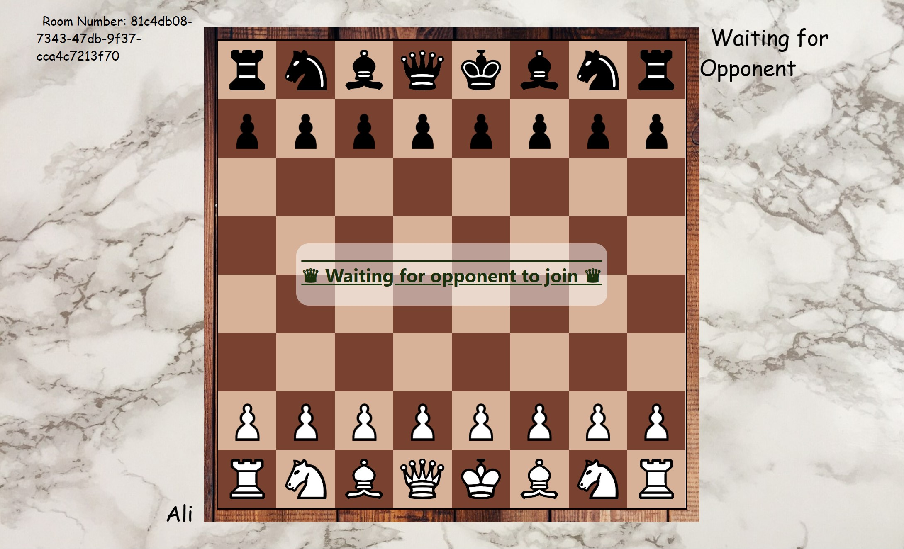
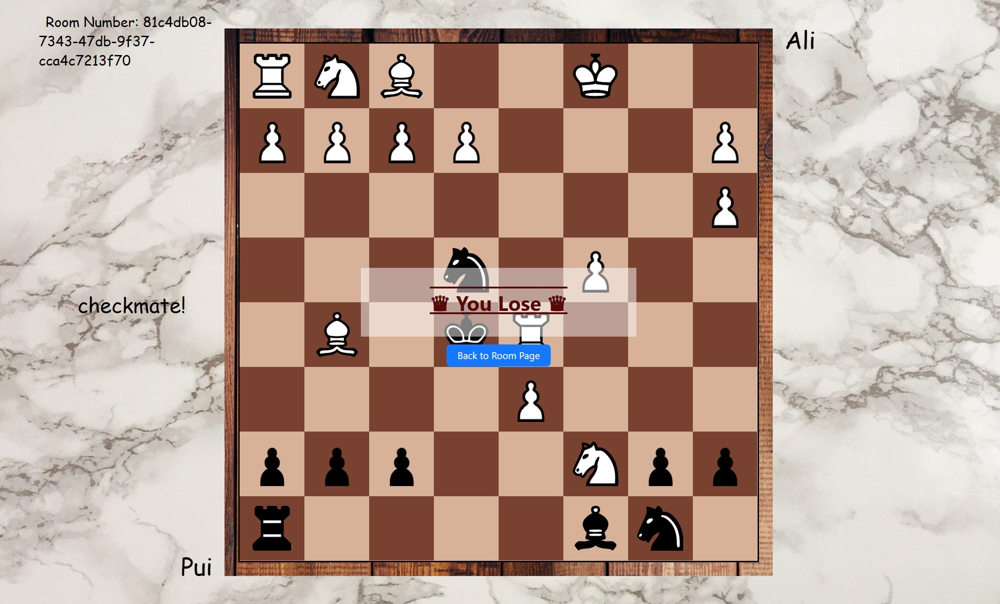

# 網服 期末專題報告

## 服務基本資訊
+ 組別：12 
+ 組長：B09705007 張力升
+ 組員：B09705027 許圃菘 B09705033 陳亮妤
+ 題目名稱：西洋棋連線對戰遊戲 （原本為棒球紀錄系統，後來改變題目）
+ Deployed service 網址：（Deploy 失敗）
+ Github Repo 網址： https://github.com/LiSeng0903/WP_Chess.git
+ Demo 影片網址：https://drive.google.com/file/d/1b3VDt2azOILfMTUuzrLIwBWxMfxFBmDj/view?usp=sharing
+ FB 社團貼文網址：https://www.facebook.com/groups/NTURicWebProg/permalink/1828664277481484/
+ 這個服務在做什麼：讓玩家可以在線上下西洋棋

## localhost 安裝與測試之詳細步驟
此 Application 為 server-client 架構。執行 server process 的電腦必須要完成後端的所有設置；執行 client 的則須完成前端的所有設置。目前只支援在同一個 subnet 下的電腦連線。

### 安裝
#### 後端設置
1. 下載前端所需 package：在 `final/WP_CHESS/backend` 下執行 `yarn install`。
2. 設定 server 執行的 IP，要查看電腦在 LAN 中的 ip 位址，並且修改 `final/WP_CHESS/backend/src/server.js` 中的 `SERVER_IP`，例如 `SERVER_IP = '192.168.1.104'`。
3. 設定 mongoDB：在 `final/WP_CHESS/backend` 下放入 `.env` 檔案。檔案內容加入 `MONGO_URL=<Your mongo url>`。
4. 設定 server 使用的 PORT：Server process 設定是使用 port 4000，如果您的電腦 port 4000 已經有跑其他 process 的話，可以在 `.env` 檔案中設定希望 server 執行的 port，加入 `PORT=<desired port>`。
5. 初始化資料庫（optinal）：可以選擇要不要初始化資料庫，初始化的話資料庫會被清空，剩下三筆測試帳號，建議第一次執行初始化資料庫。接下來 server 重開的話可以不用初始化。
初始化的作法是將 `final/WP_CHESS/backend/src/server.js` 中的 `INIT` 變數改成 `true`。

6. 啟動 server：在 `final/WP_CHESS` 下執行 `yarn backend`。待 terminal 出現 `server is on 4000`, `db connected`, `mongo db connection created` 訊息後代表 server 成功執行。

#### 前端設置
1. 下載前端所需 package：在 `final/WP_CHESS/frontend` 下執行 `yarn install`。
2. 設定 server 執行的 IP，問到執行 server process 電腦的 IP，並且修改 `final/WP_CHESS/frontend/src/containers/hooks/useChess.js` 中的 `SERVER_IP`，例如 `SERVER_IP = '192.168.1.104'`。
3. 啟動 client：在 `final/WP_CHESS` 下執行 `yarn frontend`。 

### 測試
#### 登入
前端打開會進入登入介面

##### 已註冊
如果帳號已註冊，那麼可以直接用 User name 及之前註冊時的 password 登入

如果 server 有初始化資料庫，那麼會有三組測試帳號：
|User|Password|
|-----|---------|
Ali|11111111|
Pui|22222222|
Lia|33333333|

##### 尚未註冊
如果還沒註冊帳號，可以點擊 Register 的按紐，進入註冊介面，在此填入 User name 及 password 即可註冊。（如果名字已經被取過，則無法註冊）

#### 進入遊戲
進入遊戲的方式分為兩種，一種是建立新遊戲；另一種則是加入別人已經建立的遊戲

##### 建立新遊戲
點擊 Create a Room 即可建立新遊戲。進入新遊戲後必須要等待對手加入才能開始下棋。

畫面中央會出現 Waiting for opponent to join 的字樣。這時可以將左上角的房間 ID 分享給想一起玩的人，讓他加入遊戲。此例中房間 ID 是 `81c4db08-7343-47db-9f37-cca4c7213f70`

##### 加入遊戲
在 Enter a Room Number 輸入房間 ID，接下來點擊 Join 即可加入

#### 開始遊戲
雙方都進入遊戲之後就可以開始下棋，規則比照正式西洋棋規則，由白方先走，黑白雙方輪流一人一回合。
因此玩家會有兩種狀態：「對手的回合」及「自己的回合」，以下分別說明玩家在這兩種狀態可以做的事。

#### 對手的回合
正在等待的一方螢幕上會出現 Waiting for opponent 的字樣，且不能進行任何操作，例如一開始的黑方

#### 自己的回合
可以進行兩種操作：預覽可走的步、移動
+ 預覽：點擊自己持有的棋子，螢幕上會顯示該棋子這回合可以走的步，並且在點擊的棋子下會出現黃色，提示玩家接下來要移動的棋子。預覽只有自己會看到，對手的棋盤不會有任何變動。（註：某些狀況會導致 check，因此棋子無法走他平常可以走的步，此並非 bug，是防呆機制。另外，入堡、吃過路兵等規則也有實作）

+ 移動：在預覽後，點即可走的步，就會移動該顆（背景為黃色）的棋子。移動後對手的棋盤也會出現相應的變化。移動後如果有 check，那麼螢幕上就會出現字幕提示

#### 結束遊戲
當 checkmate 發生時，遊戲即結束，螢幕會出現輸贏的字樣，接下來按 Back to Room Page 可以回到主畫面

#### 同帳號登入
如果同一個帳號同時從兩個地方登入，較早登入的帳號將會喪失連線，並跳出帳號從其他地方登入的提示，玩家無法再從這個連線進行遊戲，只能點選 Back to Login Page 的按鈕，回到登入前。

## 每位組員之負責項目
### 張力升
前端邏輯設計、與後端連線

### 許圃菘
設計 server、連接資料庫、與前端連線、西洋棋邏輯

### 陳亮妤
前端介面設計、找美術素材

## 如果此專題是之前作品/專題的延伸，請務必在此說明清楚 (本學期的貢獻)
本專案為 111-1 網路技術與應用的期末專案延伸。當時的組員有許圃菘、張力升及另一位同學，但另一位同學主要負責程式碼以外的地方，因此程式碼也是由這次網服的組員在這學期完成的。

網路技術與應用的期末專案原先只能進行單局遊戲，且介面簡單。接下來我們加入了使用者登入的系統，及可以同時開啟許多場遊戲的功能，將整個對戰遊戲變得更完善，介面也進行了許多優化。

下圖為就專案的遊戲畫面，Client 一連上 server 之後就會進入棋局，並沒有登入系統。

另外，如果有超過兩個 client 連上 server，也都會進入同一場棋局中，只有第一個 client 是白方，其他都是黑方，且都可以進行活動。遊戲結束後就必須要重啟 server 才能再玩下一場遊戲。

登入頁面、同時開啟多局遊戲、遊戲結束之後可再開新局、介面優化等都是本次網服專案新加入的功能。

## 使用第三方套件
### 套件
+ 前端：react, antd
+ 後端：Http, Express, uuidv4, dotenv-defaults, nodemon, bcryptjs
+ 資料庫：mongoose

### 圖片來源
+ Login、Jion 背景：https://pixabay.com/photos/chess-chessboard-board-game-3960184/
+ 棋盤背景：https://pixabay.com/photos/floor-wood-hardwood-floors-1256804/
+ 下棋背景：https://pixabay.com/photos/marble-background-backdrop-1006628/
+ 西洋棋圖片：https://github.com/AhmadAlkholy/Javascript-Chess-Game/tree/master/img

## 專題製作心得
### 張力升
在這次的專案中我負責的是前端的部分，我原本在上課的過程中覺得撰寫前端是一個簡單的作業，只要把架構決定好，剩下的就只要把內容填上就行，但是這次寫完完整的前端才感覺到，前端確實也不容易，有很多設計上的細節要注意，也必須花費很多心思以及時間。另外，這次也是我第一次和別人合作開發一個東西，這一次我才體驗到確實的分工在寫程式的體驗上是什麼感覺，也感覺到和別人合作確實是一項需要練習的技巧。這次算是收獲相當豐盛。

### 許圃菘
這次的專案充分體會到要從頭到尾弄好一個網路服務有多困難。最麻煩的地方在於紀錄許多連線、玩家跟遊戲的關係，某個玩家可能從許多地方登入、玩到一半重新登入等等，有許許多多的可能性都需要去考慮，才能讓人們體驗到完整的服務，不會玩到一半卡住。另外，要將許多不同的套件跟其他人的服務串起來也很困難。總之整個網服就是困難重重，但能做到的效果也很多、很厲害。

### 陳亮妤
由於學期改為 16 週，許多課堂的期末的時間規劃略微緊湊，接腫而至的專案限縮了不少發揮空間。但此次專案仍讓我獲益良多，要維持版面的整齊需要調動許多參數、發揮創意，而實作結果時常不盡人意，需要多次修改，以及考慮介面對使用者直觀與否，並且考慮排版的改動對功能是否會有影響。這次的練習使我對於套件的使用有更大的了解，對網頁的設計與排版更加熟悉。也很謝謝隊友們的付出，合力完成網頁，讓專案成果能夠完整得呈現。
